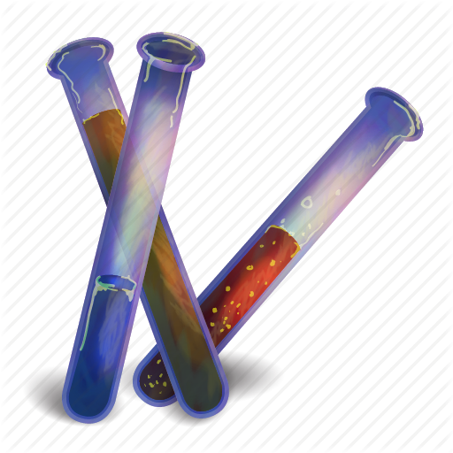

Alchemy Git Collaboration Kata
==============================

**(En español más abajo)**

### Instructions

> Hello, git apprentices! This is your initial test to become alchemists. To pass the test, you must tell me how each
component works, and then mix them into the mighty _white component_! 

This is a git Kata. Each team must have three pairs of programmers (blue, green and red). 
- The **blue** pair must fork this repository and create the team's **remote repo**.
- Each team can *only* work on its color component.
- Complete your component's code to pass the failing test. Then you can push your changes.
- The first pair in the team can try to fabricate the **white** component.
 
 
#### Components 

Each component has a _power_ level, that depends on two parameters: the number of drops in the vial and the number of
seconds it remains in the vial.

##### The Mighty White Component

> To create the white component, the team must know how each color component works

This is, to pass the White Component Test you need to pass all the previous tests first! 

--------

### Instrucciones

> Hola, aprendices de git! Ésta es vuestra prueba inicial para convertiros en _Alquimistas_. Para pasar la prueba, 
> debéis decirme cómo funciona cada componente y después mezclarlos para formar el poderoso _componente blanco_!

Esta es una kata de Git. Cada equipo debe tener 3 parejas de programadoras (blue, green y red).
- La pareja **blue** debe hacer _fork_ de este repositorio y crear el repositorio remoto del equipo.
- Cada pareja debe trabajar sólo en su componente correspondiente.
- Para completar un componente, hay que escribir el código que hace pasar los tests. Después puedes hacer `push` de tus cambios.
- La primera pareja del equipo que termine su componente puede intentar completar el componente `white`

#### Componentes

Cada componente tiene un nivel de energía (`power`) que depende de dos parámetros: el número de gotas (`drops`) en cada 
vial y el tiempo (`seconds`) que permanece en el vial.

##### El poderoso componente blanco

> Para crear el componente de color blanco, el equipo debe conocer cómo funcionan los demás componentes.

Dicho de otra forma, para hacer pasar los tests del componente blanco hay que hacer pasar los de los demás componentes 
primero.
